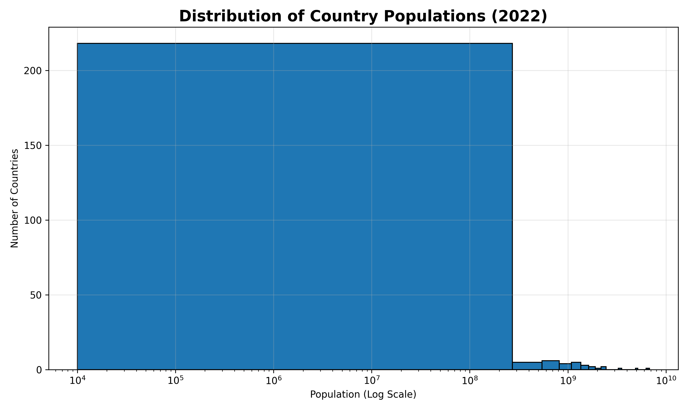
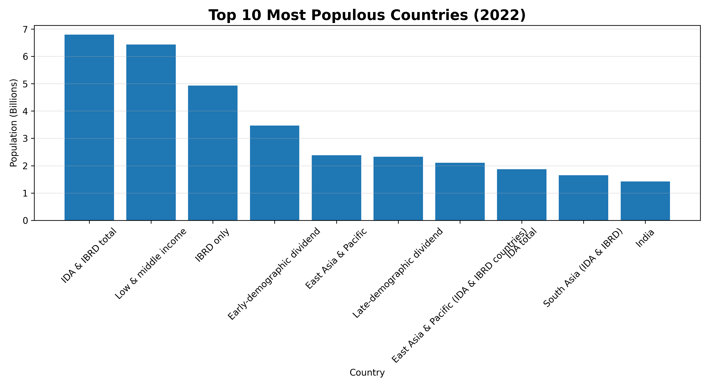

# 📊 Prodigy InfoTech Data Science Internship

## Task 01 - Data Visualization

### 📌 Objective

Create a bar chart or histogram to visualize the distribution of a categorical or continuous variable.

---

## 📂 Dataset

World Bank Population Dataset (Total Population - 2022)

Source:
https://data.worldbank.org/indicator/SP.POP.TOTL

---

## 🛠 Technologies Used

- Python
- Pandas
- Matplotlib

---

## 📈 Visualizations

### 1. Histogram

Shows the distribution of country populations in 2022.

The x-axis is displayed on a logarithmic scale because population values vary greatly among countries.

---

### 2. Bar Chart

Displays the Top 10 Most Populous Countries in 2022.

---

## 📷 Output

### Histogram

### Bar Chart

---

## 📚 Skills Learned

- Reading CSV files using Pandas
- Cleaning and preprocessing data
- Data visualization using Matplotlib
- Saving charts as PNG images
- Working with real-world datasets

---

## 👩‍💻 Author

Prachi Arora

Data Science Intern @ Prodigy InfoTech